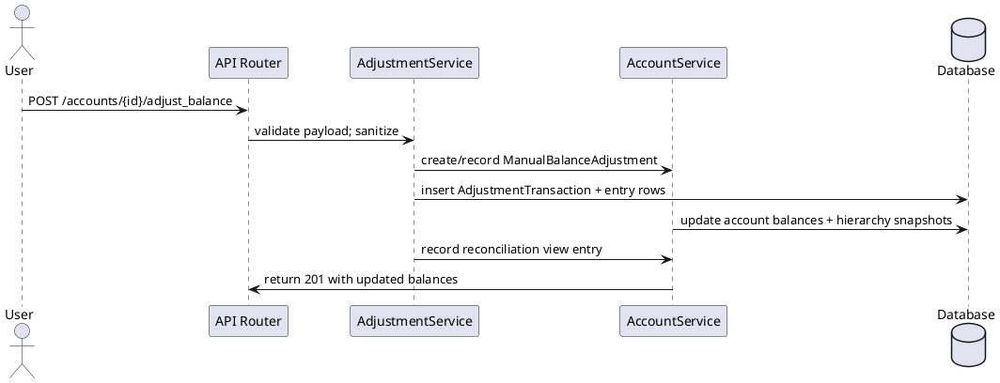

# sdd-cash-manager Solution Architecture

This document outlines the solution architecture for the sdd-cash-manager system, using the C4 model for visualization. The system is designed as a self-contained application with a clear separation of concerns across different layers and components.

## Level 1: System Context

This diagram shows the sdd-cash-manager system as a whole and its interaction with external users.

```plantuml
@startuml
!includeurl https://raw.githubusercontent.com/plantuml-stdlib/C4-PlantUML/master/C4_Context.puml

title sdd-cash-manager System Context

' Level 1: System Context
System_Boundary(system_context_boundary, "sdd-cash-manager System Context") {
    Person(user, "User", "Interacts with the system to manage finances.")
    System(cash_management_system, "Cash Management System", "Manages financial accounts and transactions.")
    Rel(user, cash_management_system, "Uses", "HTTPS")
}
@enduml
```

## Level 2: Container Diagram

This diagram zooms into the `Cash Management System` to show its main deployment containers: the API Application and the Database.

```plantuml
@startuml
!includeurl https://raw.githubusercontent.com/plantuml-stdlib/C4-PlantUML/master/C4_Container.puml

title sdd-cash-manager Container Diagram

' Level 2: Containers within the System
System_Boundary(system_boundary, "sdd-cash-manager Solution") {
    ContainerDb(database_container, "Database", "PostgreSQL/SQLite", "Stores financial account and transaction data.")

    System_Boundary(api_container_boundary, "API Container") {
        Container(api_app, "API Application", "Python/FastAPI", "Provides a RESTful API for the cash management system.")
    }

    ' Level 2 Relationships
    Rel(api_app, database_container, "Reads from and writes to", "SQL")
}
@enduml
```

## Level 3: Component Diagram (API Application)

This diagram details the components within the `API Application` container.

```plantuml
@startuml
!includeurl https://raw.githubusercontent.com/plantuml-stdlib/C4-PlantUML/master/C4_Component.puml

title sdd-cash-manager Component Diagram (API Application)

' Level 3: Components within the API Container
Boundary(api_component_boundary, "API Components") {
    Component(api_routers, "API Routers", "Python", "Handles incoming HTTP requests, routing, and basic validation.")
    Component(service_layer, "Service Layer", "Python", "Core business logic: account management, transaction processing.")
    Component(data_access_layer, "Data Access Layer", "Python/SQLAlchemy", "Manages database interactions, ORM models, and session management.")
    Component(shared_components, "Shared Components", "Python", "Configuration, authentication (JWT), utilities.")
}

' Level 3 Relationships
Rel(api_routers, service_layer, "Uses", "Dependency Injection")
Rel(service_layer, data_access_layer, "Uses", "Dependency Injection")
Rel(service_layer, shared_components, "Uses", "Dependency Injection")
Rel(api_routers, shared_components, "Uses", "Dependency Injection")
@enduml
```

## Level 4: Deployment Diagram

This deployment diagram highlights how the FastAPI application, database, and CI tooling are provisioned in a typical environment (local dev or containerized CI run).

```plantuml
@startuml
!includeurl https://raw.githubusercontent.com/plantuml-stdlib/C4-PlantUML/master/C4_Deployment.puml

title sdd-cash-manager Deployment

Deployment_Node(web_server, "API Host", "Ubuntu container") {
    Container(api_app, "sdd-cash-manager API", "Python/FastAPI", "Handles HTTP requests, JWT auth, logging, and services.")
    ContainerDb(database, "SQLite / PostgreSQL", "SQL", "Stores accounts, transactions, adjustments, and reconciliation entries.")
}

Deployment_Node(ci_runner, "CI Runner", "CI/CD agent") {
    Container(test_runner, "CI Test Runner", "Pytest + uv scripts", "Executes `scripts/pre_commit_checks.sh` with coverage reporting.")
}

Rel(test_runner, api_app, "Deploys & tests")
Rel(api_app, database, "Reads from and writes to", "SQL")
Rel(web_server, ci_runner, "Provisioned by")
@enduml
```

## Architectural Overview

The sdd-cash-manager is designed with a layered architecture:

1. **User (Person):** Interacts with the system through an HTTPS interface.
2. **API Application (Container):** A Python/FastAPI application serving as the primary interface for client interactions. It handles request routing, business logic orchestration, and data persistence.
   - **API Routers (Component):** The entry points for requests, responsible for request parsing, validation, and delegating tasks to the service layer.
   - **Service Layer (Component):** Houses the core business logic, including account management and transaction processing, ensuring financial integrity.
   - **Data Access Layer (Component):** Manages all interactions with the database using SQLAlchemy, including defining models and handling sessions.
   - **Shared Components (Component):** Contains cross-cutting concerns such as configuration loading, authentication mechanisms (e.g., JWT), and utility functions.
3. **Database (Container):** A persistent data store, using PostgreSQL in production and defaulting to SQLite for development. It stores all financial data.

This architecture promotes modularity, testability, and maintainability.

## Implementation Modules

- **Application entry & configuration:** `src/sdd_cash_manager/main.py` wires FastAPI, CORS, a `/health` check, and includes the account, transaction, quick-fill, adjustment, and reconciliation routers so each capability exposes its own prefix while sharing middleware, version metadata, and JWT guards.
- **Database plumbing:** `src/sdd_cash_manager/database.py` bootstraps the SQLAlchemy engine, manages sessions, and seeds the balancing account so services can open scoped sessions without scattering engine creation logic across files.
- **API routers:** `src/sdd_cash_manager/api/accounts.py` orchestrates the REST surface for accounts, transactions, quick-fill templates, and integrates with `src/sdd_cash_manager/api/v1/endpoints/adjustment.py` and `reconciliation.py`, keeping schema validation, filtering, and HTTP status handling close to the route definitions.
- **Service layer:** The `services/` package houses `AccountService`, `TransactionService`, `AdjustmentService`, and `ReconciliationService`. Each service enforces domain invariants (double-entry balancing, hierarchy caching, duplicate detection, reconciliation status updates), shares helpers (balance snapshots, encryption, logging), and exposes deterministic operations to the API layer. Dependency injection ensures services can be tested in isolation with either direct sessions or factories.
- **Domain models & schemas:** The `models/` package defines the canonical entities (`Account`, `Transaction`, `Entry`, `AdjustmentTransaction`, `ReconciliationViewEntry`, `AccountMergePlan`, `QuickFillTemplate`, etc.), while `schemas/` declares the Pydantic contracts consumed by FastAPI and the `/specs` artifacts that document the payload shapes.
- **Shared utilities:** `lib/auth.py`, `lib/validation.py`, `lib/security_events.py`, `lib/logging_config.py`, `lib/encryption.py`, `lib/utils.py`, and `lib/state_management.py` capture cross-cutting concerns such as JWT auth, sanitization, structured logging, encryption, sensitive-data auditing, and application state tracking.

## Data Model & Transaction Guarantees

- **Double-entry integrity:** Every transaction persists paired `Entry` rows (debit and credit) through `TransactionService`, which tests balance invariants before changing account balances, records snapshots, and commits the ledger in a single atomic operation.
- **Hierarchical totals:** `AccountService` keeps an in-memory cache for quick lookups, falls back to recursive CTEs when needed, and provides the `hierarchy_balance` field so parent accounts immediately reveal aggregated totals without replaying entries.
- **Quick-fill & reconciliation:** Historical transactions feed `QuickFillTemplate`s exposed via the quick-fill router; adjustments and reconciliation flows emit `ReconciliationViewEntry` records so external consumers (and the upcoming `/specs/005-reconciliation/` workstream) can trust the status metadata.
- **Adjustment auditing & security:** `AdjustmentService` orchestrates `ManualBalanceAdjustment`/`AdjustmentTransaction` creation and uses `lib/security_events` to log sanitized metadata, satisfying SonarCloud’s injection checks while offering a forensic trail for auditors.

## Spec-Driven Evolution

- **Account Management (`specs/001-account-management/`)** governs account types, hierarchy, balance snapshots, and manual adjustments, linking directly to the service/application flow described above.
- **API Pytest coverage (`specs/002-add-api-pytests/`)** ensures JWT enforcement, quick-fill helpers, and validation errors stay covered by the `tests/api` suite, validating both happy and unhappy paths for each endpoint.
- **Adjust Balance Window (`specs/003-adjust-balance/`)** formalizes the adjustment UI payload, timing, and logging requirements that the API and `AdjustmentService` implement.
- **Transaction Management (`specs/004-transaction-management/`)** drives the quick-fill heuristics, duplicate consolidation, and double-entry guarantees that appear in service code and data models.
-- **Reconcile window:** With specs delivered in `specs/005-add-reconcile-window/`, the API now exposes `/reconciliation/sessions`, `/reconciliation/sessions/unreconciled`, and `/reconciliation/sessions/{session_id}/transactions`. These endpoints support entering statement balances, filtering UNCLEARED/CLEARED transactions, and delivering difference-insight metadata so the UI can confirm zero-difference reconciliation attempts alongside guidance for outstanding gaps.

## Supporting Infrastructure and Quality

The project relies on tooling that keeps this architecture healthy:

- **Automated analysis & security:** `scripts/pre_commit_checks.sh` kicks off uv/poetry dependency sync, Ruff, Pyright, Mypy, Snyk, Behave, and coverage-aware Pytest before commits, ensuring the architecture surfaces (API + services) stay consistent with the specs.
- **SonarCloud & coverage gating:** SonarCloud monitors logging/validation rules (e.g., `lib/logging_config` sanitization, injection resistance) while Pytest coverage reports (`--cov=src --cov-report=term-missing`, `--cov-fail-under=90`) verify every service module—including `src/sdd_cash_manager/services/`—remains exercised.
- **Documentation & plans:** The diagrams above are complemented by `/specs/[###-feature-name]/` artifacts, which describe requirements, plans, and tasks, ensuring architecture decisions remain aligned with the implemented feature set.
## Additional Views

### Adjustment Sequence

This UML sequence diagram summarizes the manual balance adjustment flow, emphasizing the interplay between the user request, FastAPI router, services, and the database.


