# Architecture Patterns Inventory

This document lists the main software architecture patterns used in this repository and provides a short PlantUML diagram for each pattern showing the conceptual structure.

## Pattern Documentation Format
Each pattern includes:
- **Aliases**: Alternative names or related patterns
- **Category**: Classification level (Conceptual, Logical, Physical, Implementation)
- **Description**: Purpose and usage
- **Reference**: Link to authoritative internet resource
- **Diagram**: Visual representation

---

## Layered Architecture (Presentation → Service → Model/DB)

- **Aliases**: N-Tier Architecture, Three-Tier Pattern, Separation of Concerns
- **Category**: Conceptual, Logical
- **Description**: Clear separation between API controllers (presentation), service/business logic (application), and persistence models (data). Each layer has distinct responsibilities and minimal cross-layer coupling. Controllers handle HTTP concerns, services encapsulate business logic, and repositories manage data access.
- **Reference**: https://en.wikipedia.org/wiki/Multitier_architecture

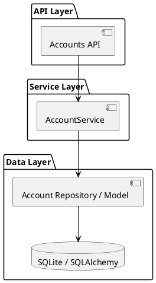

---

## Dependency Injection (per-request)

- **Aliases**: Inversion of Control (IoC), Constructor Injection, FastAPI Depends Pattern
- **Category**: Implementation, Logical
- **Description**: FastAPI's `Depends` mechanism injects dependencies (DB sessions, services, auth context) into endpoint handlers at request time. Enables loose coupling, testability, and lifecycle management without manual instantiation or global state.
- **Reference**: https://martinfowler.com/articles/injection.html

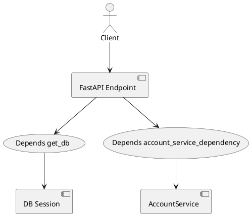

---

## Service Layer

- **Aliases**: Application Service, Use Case Handler, Business Logic Facade
- **Category**: Logical, Implementation
- **Description**: Business logic encapsulated in service classes (AccountService, TransactionService). Services orchestrate workflows, coordinate between repositories, enforce domain rules, and provide transaction boundaries. Acts as the primary entry point for use cases.
- **Reference**: https://martinfowler.com/eaaCatalog/serviceLayer.html

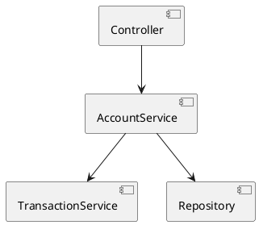

---

## Data Access / Active Record (SQLAlchemy)

- **Aliases**: ORM Pattern, Repository Pattern, Persistence Layer
- **Category**: Physical, Implementation
- **Description**: SQLAlchemy ORM models represent domain entities and map to database tables. Services use session objects to query, create, update, and delete records. Abstracts SQL details and provides a Pythonic interface to the database layer.
- **Reference**: https://martinfowler.com/eaaCatalog/repository.html

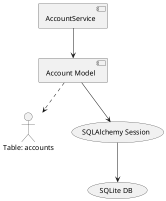

---

## Unit-of-Work / Transaction Management

- **Aliases**: Transaction Scope Pattern, Session Per Request, Atomic Operations
- **Category**: Logical, Implementation
- **Description**: Per-request DB session encapsulates a unit of work. Services explicitly manage commit/rollback within transaction boundaries, ensuring ACID compliance and data consistency. Prevents partial updates and enables rollback on errors.
- **Reference**: https://martinfowler.com/eaaCatalog/unitOfWork.html

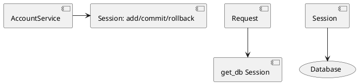

---

## DTOs / Validation (Pydantic)

- **Aliases**: Data Transfer Object Pattern, Request/Response Schema, API Contract
- **Category**: Logical, Implementation
- **Description**: Pydantic models define input and output contracts for API endpoints. Provide automatic validation, serialization, deserialization, and type coercion. Decouple API representations from internal domain models, supporting schema evolution and API versioning.
- **Reference**: https://martinfowler.com/bliki/DataTransferObject.html

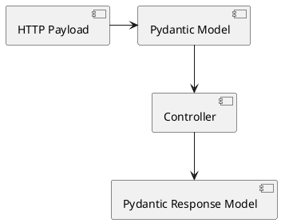

---

## RESTful API / Resource Controllers

- **Aliases**: REST Pattern, Resource-Oriented Design, APIRouter Pattern
- **Category**: Conceptual, Logical, Implementation
- **Description**: FastAPI APIRouters organize endpoints around REST resources (accounts, transactions, entities). Endpoints follow HTTP verbs (GET, POST, PUT, DELETE) and return standard status codes (200, 201, 400, 404, 500). Enables intuitive, stateless API design and discoverable resource operations.
- **Reference**: https://restfulapi.net/

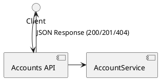

---

## Authentication & RBAC

- **Aliases**: Role-Based Access Control, Bearer Token Pattern, JWT Pattern
- **Category**: Logical, Implementation
- **Description**: JWT tokens encode user identity and roles. Dependency functions decode and verify tokens, extract TokenPayload, and enforce role requirements per endpoint via `require_role` patterns. Enables stateless authentication across distributed services and fine-grained authorization.
- **Reference**: https://tools.ietf.org/html/rfc7519

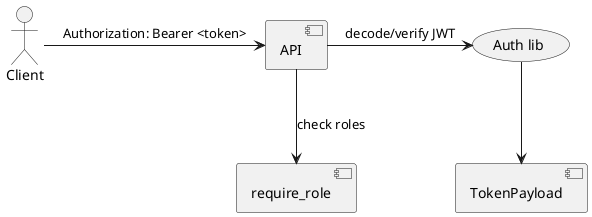

---

## Cross-cutting Concerns / AOP-style Modules

- **Aliases**: Aspect-Oriented Programming (AOP), Utility Modules, Middleware Pattern
- **Category**: Implementation
- **Description**: Logging, security event tracking, and encryption provided as separate reusable modules invoked across multiple layers. Centralizes concern management, reduces code duplication, and simplifies maintenance of non-functional requirements. Commonly applied via decorators, dependency injection, or middleware.
- **Reference**: https://en.wikipedia.org/wiki/Aspect-oriented_programming

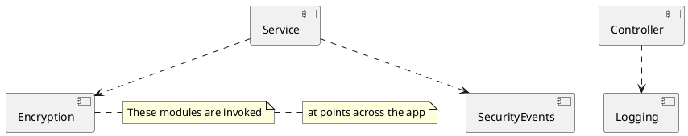

---

## Input Sanitization & Defensive Validation

- **Aliases**: Input Validation Pattern, Security Validation, Data Cleansing
- **Category**: Implementation
- **Description**: Helper validators and sanitizers enforce allowed characters, length limits, format constraints, and reject suspicious inputs before processing. Acts as defense-in-depth against injection attacks, malformed data, and invalid states. Applied at API boundary and service layer.
- **Reference**: https://owasp.org/www-community/attacks/injection

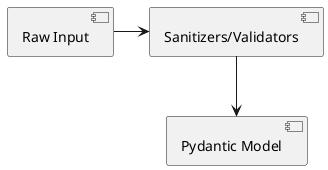

---

## Enum / Adapter for Compatibility

- **Aliases**: Adapter Pattern, Legacy Bridge, Canonical Value Mapping
- **Category**: Logical, Implementation
- **Description**: Enums (e.g., BankingProductType) map external/legacy values to canonical internal representations. Include aliases and conversion logic to handle API evolution, data migrations, and interoperability with legacy systems while maintaining internal consistency.
- **Reference**: https://refactoring.guru/design-patterns/adapter

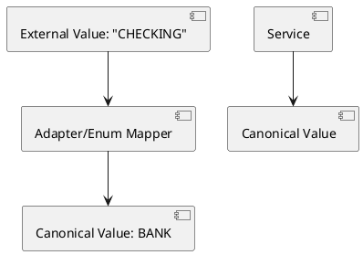

---

## Error Handling & HTTP Mapping

- **Aliases**: Exception Mapping Pattern, Error Response Pattern, Fault Handling
- **Category**: Logical, Implementation
- **Description**: Domain and application exceptions are caught and mapped to appropriate HTTP responses (HTTPException with status codes: 400, 404, 500, etc.). Centralizes error translation, ensures consistent error responses, and provides clear feedback to clients. Validation errors handled via exception middleware.
- **Reference**: https://en.wikipedia.org/wiki/Exception_handling

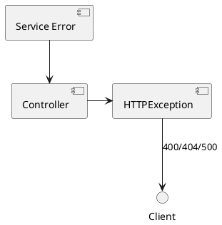

---

## Configuration-driven Behavior

- **Aliases**: Configuration Pattern, Environment-based Config, Feature Flags
- **Category**: Implementation
- **Description**: Centralized configuration (core/config.py) loaded from environment variables influences app behavior, defaults, and feature toggles across layers. Enables environment-specific behavior (dev, test, prod) without code changes, supporting 12-factor app principles and infrastructure flexibility.
- **Reference**: https://12factor.net/config

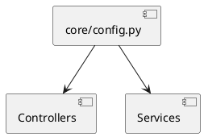

---

## Test Patterns / Integration Testing

- **Aliases**: In-Process Testing, ASGI Test Transport, Fixture-based Testing
- **Category**: Implementation
- **Description**: In-process ASGI testing via httpx.AsyncClient with ASGITransport + pytest fixtures enables fast, isolated integration tests without spinning up a real server. Tests run the full FastAPI app stack with in-memory or test databases, providing realistic coverage with minimal overhead.
- **Reference**: https://docs.pytest.org/en/stable/fixture.html

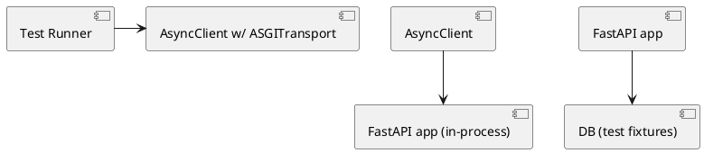

---

## Seeding & Cleanup for Tests

- **Aliases**: Test Data Management, Fixture Cleanup, Test Lifecycle Management
- **Category**: Implementation
- **Description**: Pytest fixtures create seed data via API endpoints, store created identifiers, and clean up afterwards. Ensures test isolation, reproducible state, and efficient resource management. Reduces test coupling to direct database access while verifying the API's own data creation paths.
- **Reference**: https://docs.pytest.org/en/stable/fixture.html

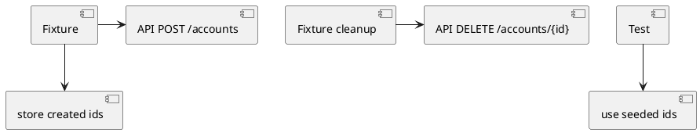

---

## Domain-specific Value Handling

- **Aliases**: Value Normalization Pattern, Canonical Transformation, Domain-Driven Conversion
- **Category**: Logical, Implementation
- **Description**: Value normalization (Decimal quantization for currency, enum mapping for product types, date formatting) occurs at API boundary and service layer. Ensures domain invariants are maintained, external representations are transformed to canonical internal forms, and calculations use correct precision.
- **Reference**: https://en.wikipedia.org/wiki/Domain-driven_design

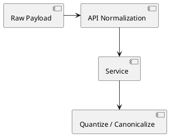

---

## Notable omissions

- No DB migration tool (e.g., Alembic) detected in the repository.
- No CQRS/event-sourcing or message bus patterns present.

---

### Rendering diagrams

To render these PlantUML diagrams using the local PlantUML server mentioned, POST or GET the diagram text to `http://localhost:8080` following PlantUML server API conventions (e.g., `/png` or `/svg` endpoints with encoded diagram). Example (local environment):

```
POST http://localhost:8080/svg
Body: @startuml\nAlice -> Bob: Hi\n@enduml
```

---

Generated on: 2026-03-14
