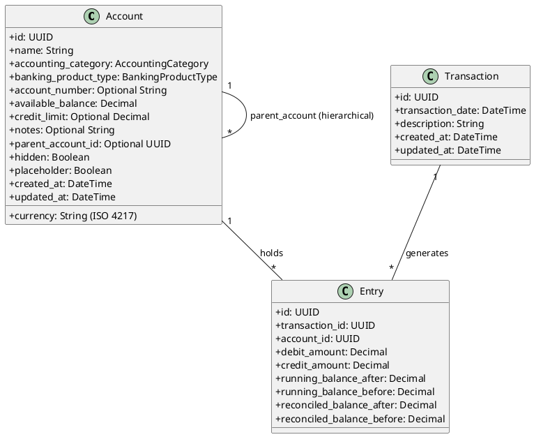
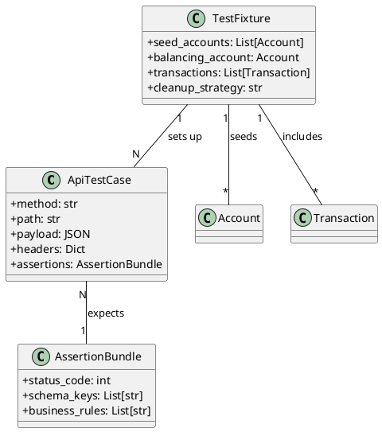
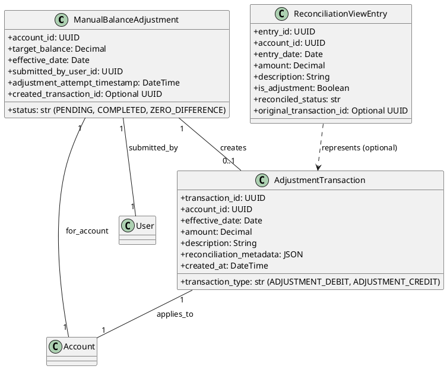
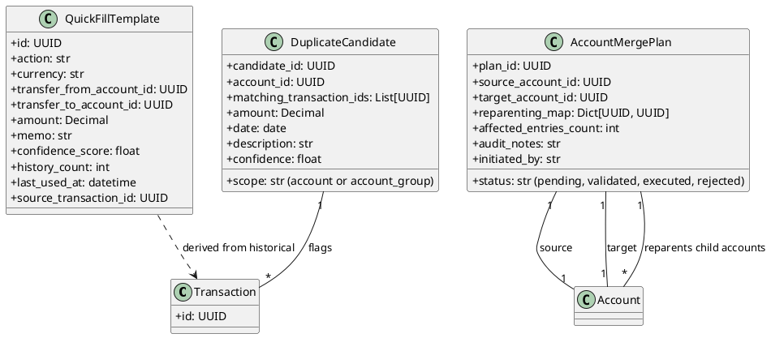

# Data Models

This document consolidates the data model specifications from various feature documents. It provides an overview of key entities, their attributes, relationships, and validation rules, visualized with embedded PlantUML diagrams.

## Account Management Data Model

Details from `specs/001-account-management/data-model.md`.

### Core Entities

- **Entities**: `Account`, `Transaction`, `Entry`.
- **Account**: Represents a financial account with hierarchical structure, various attributes, and state flags (`hidden`, `placeholder`).
- **Transaction**: A financial event affecting multiple accounts.
- **Entry**: A single debit or credit line item within a `Transaction`, linked to an `Account`.
- **Validation**: String lengths, character restrictions, numeric constraints, enum types, UUID formats, existence checks, ISO 4217 currencies, and double-entry integrity.

## API Testing Artifacts Data Model

Details from `specs/002-add-api-pytests/data-model.md`. These models describe testing-related entities.

### Testing Constructs

- **Entities**: `API Test Case`, `Test Fixture`, `Assertion Bundle`.
- **API Test Case**: Represents an HTTP interaction with the API.
- **Test Fixture**: Sets up the necessary environment state (accounts, transactions) for tests.
- **Assertion Bundle**: Defines expected outcomes and business rules for API responses.
- **Validation**: Deterministic test data, isolated fixtures, and comprehensive assertion checks.

## Balance Adjustment Data Model

Details from `specs/003-adjust-balance/data-model.md`.

### Adjustment Entities

- **Entities**: `ManualBalanceAdjustment`, `AdjustmentTransaction`, `ReconciliationViewEntry`.
- **ManualBalanceAdjustment**: Represents a user-initiated request to manually adjust an account's balance.
- **AdjustmentTransaction**: An automatically generated ledger entry for the balance adjustment.
- **ReconciliationViewEntry**: A projection for reconciliation display, potentially including adjustment data.
- **Validation**: Target balance non-negative, date considerations, user reference, amount calculation, transaction type consistency.

## Transaction Management Data Model

Details from `specs/004-transaction-management/data-model.md`.

### Feature-Specific Entities

- **Entities**: `Transaction` (referencing core entity), `QuickFillTemplate`, `DuplicateCandidate`, `AccountMergePlan`.
- **QuickFillTemplate**: Generated from historical transactions for pre-populating forms.
- **DuplicateCandidate**: Flags potential duplicate transactions for review.
- **AccountMergePlan**: Details account merging, hierarchy reassignment, and audit logging.

## Data Model Assumptions & Relationships Summary

This section consolidates common assumptions and relationship summaries across the models.

- **Core Entities**: `Account`, `Transaction`, `Entry`, `User` are foundational and their detailed models are primarily defined in the 'Account Management Data Model' section.
- **Relationships**:
    - **Account Hierarchy**: `Account` can have a `parent_account_id` linking to another `Account`.
    - **Transaction-Entry**: A `Transaction` generates multiple `Entry` objects.
    - **Entry-Account**: Each `Entry` applies to a specific `Account`.
    - **Adjustment Flow**: `ManualBalanceAdjustment` may create an `AdjustmentTransaction`, which applies to an `Account`. `ReconciliationViewEntry` can represent adjustment data.
    - **Testing Context**: `TestFixture` sets up `Account` and `Transaction` data for `ApiTestCase` executions, which use `AssertionBundle`s.
    - **Transaction Management**: `QuickFillTemplate` is derived from historical `Transaction`s, `DuplicateCandidate` flags `Transaction`s, and `AccountMergePlan` involves `Account`s and child `Account`s.

- **General Validation**: Emphasis on data integrity, correct types, value constraints (e.g., non-negative balances, ISO currency codes), and referential integrity (UUIDs).
- **Double-Entry Principle**: Transactions must maintain a balanced debit and credit sum across all associated entries.
- **Date and Time**: Use of `DateTime` and `Date` types with awareness of timezone implications.
